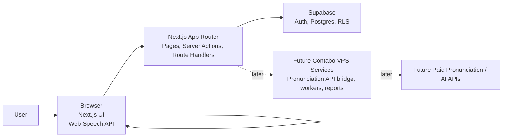
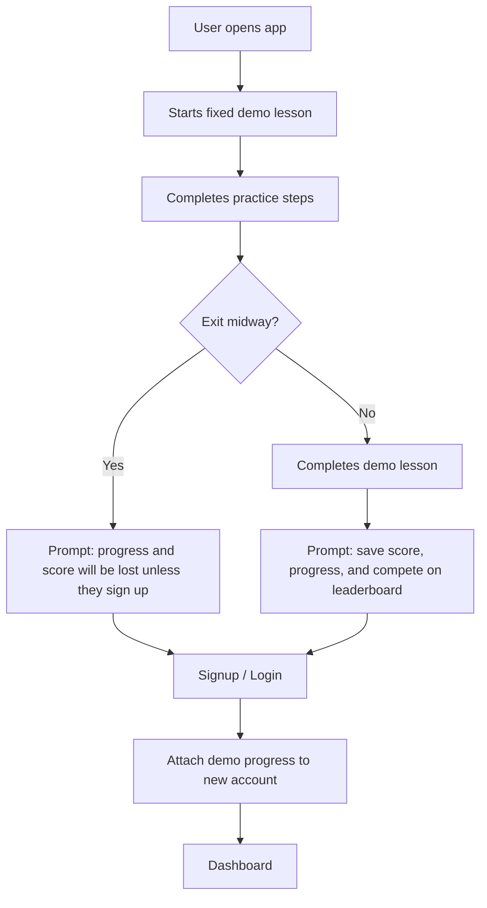
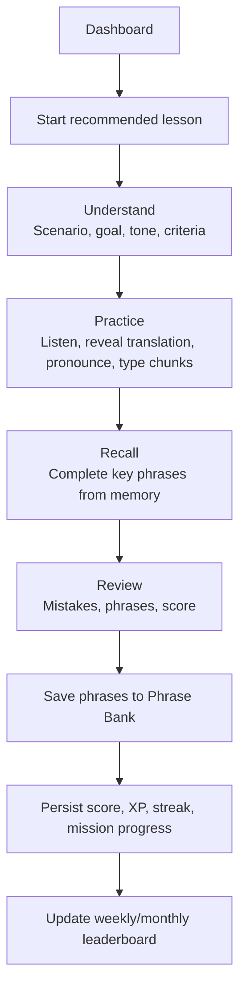
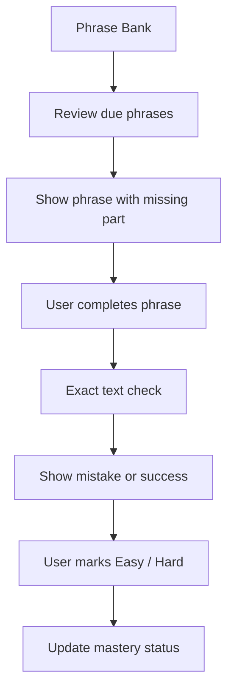

# FluentDraft Architecture

## Purpose

This document explains FluentDraft's architecture in a way that is useful for product, design, and engineering.

FluentDraft is a scenario-based English writing practice app. The core experience helps users read, listen, pronounce, type, recall, review, and save practical English phrases from real-world situations.

This document covers the high-level system shape, product domains, important user flows, and MVP-to-future architecture path. Detailed system behavior belongs in [system-design.md](./system-design.md), database design belongs in [database.md](./database.md), code organization belongs in [project-structure.md](./project-structure.md), and visual direction belongs in [style-guide.md](./style-guide.md).

## Architecture Principles

- Practice-first: every technical choice should support the learning loop, not distract from it.
- Demo-first acquisition: anonymous users can try one fixed lesson before registering.
- Save-progress conversion: signup should feel like preserving progress, score, and leaderboard eligibility.
- Supabase-first MVP: Supabase provides auth, Postgres, RLS, and persistence for the first production version.
- Browser-first pronunciation: MVP uses browser speech capabilities, with a paid pronunciation API planned later.
- Professional gamification: XP, streaks, badges, levels, ranks, missions, unlocks, and leaderboards should feel motivating without making the app childish.
- Future services only when needed: the existing Contabo VPS is reserved for later workers, AI/audio services, reports, or custom backend jobs.

## High-Level System

The MVP should keep the system simple. Next.js owns the user experience and application logic. Supabase owns authentication, data persistence, row-level security, and leaderboard data. The browser handles text-to-speech and speech recognition where supported.

## Core Product Domains

- Demo Lesson: one fixed anonymous lesson that lets users experience the product before signup.
- Auth & Onboarding: account creation, login, English level, target translation language, and country.
- Scenario Packs: curated lessons grouped by real-world use case, such as job hunting, workplace writing, and daily life.
- Practice Engine: controls the lesson phases: Understand, Practice, Recall, and Save.
- Translation Reveal: optional target-language helper inside practice, while English remains the main learning language.
- Pronunciation Feedback: browser-first phrase pronunciation check with pass/retry feedback.
- Scoring & Gamification: XP, streaks, badges, levels, ranks, missions, unlocks, and difficulty multipliers.
- Phrase Bank: saved phrases, source scenario context, mastery status, and review practice.
- Leaderboards: weekly and monthly competition with user name and country displayed.

## Key User Flows

### Anonymous Demo To Signup

### Registered Practice Lesson

### Phrase Bank Review

## Data Flow Overview

Lesson content starts as seeded data: scenario packs, scenarios, chunks, key phrases, translations, and difficulty levels.

During practice, the app tracks current phase, chunk, typed answers, pronunciation attempts, translation reveal state, mistakes, saved phrases, completion status, and final score.

Anonymous demo progress stays local/session-based until the user signs up. After signup, the app converts the demo result into the user's account so the user can keep their score, phrase saves, and progress.

Registered user progress is stored in Supabase. Row-level security should ensure users can only access their own attempts, phrase bank, reviews, streaks, missions, and profile data. Public leaderboard views can expose approved display fields such as display name, country, XP, rank, and competition period.

## MVP vs Later

| Area | MVP | Later |
| --- | --- | --- |
| Backend | Supabase Auth and Postgres | VPS workers and custom backend services if needed |
| Pronunciation | Browser Web Speech API | Paid pronunciation API with richer scoring |
| Audio | Browser/native-like voice where possible | Recorded native-speaker audio or generated premium voices |
| Translation | Reveal helper for Arabic plus common languages | Better explanations, examples, and localization |
| Gamification | XP, streaks, levels, badges, missions, weekly/monthly leaderboards | Cohorts, friends, events, advanced rewards |
| Monetization | Planned structurally only | Stripe, premium packs, custom scenarios |
| Leaderboards | Postgres-first weekly/monthly rankings | Redis or cached aggregates if traffic requires it |

## Related Docs

- [Docs index](./README.md)
- [plan.md](../plan.md)
- [system-design.md](./system-design.md)
- [database.md](./database.md)
- [api-contracts.md](./api-contracts.md)
- [project-structure.md](./project-structure.md)
- [style-guide.md](./style-guide.md)
- [testing-strategy.md](./testing-strategy.md)
