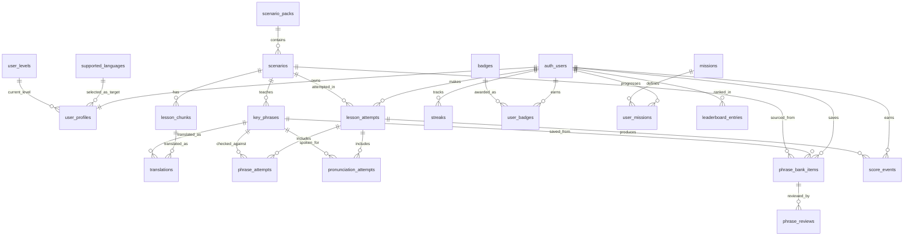

# FluentDraft Database Schema

## Purpose

This document defines the proposed Supabase/Postgres schema for the FluentDraft MVP.

It is a schema design document, not a final migration file. Use it to create Supabase migrations after implementation starts.

## Entity Relationship Diagram



## Enum Types

```sql
create type user_english_level as enum ('beginner', 'intermediate', 'advanced');
create type lesson_difficulty as enum ('beginner', 'intermediate', 'advanced');
create type lesson_phase as enum ('understand', 'practice', 'recall', 'save');
create type attempt_status as enum ('in_progress', 'completed', 'abandoned');
create type phrase_mastery_status as enum ('new', 'learning', 'mastered');
create type leaderboard_period_type as enum ('weekly', 'monthly');
create type score_event_type as enum (
  'lesson_completion',
  'accuracy',
  'recall',
  'save_phrase',
  'streak_bonus',
  'mission_bonus',
  'repeat_reduced'
);
```

## Identity And Profile

```sql
create table supported_languages (
  code text primary key,
  name text not null,
  native_name text not null,
  enabled boolean not null default true,
  created_at timestamptz not null default now()
);

create table user_levels (
  id bigserial primary key,
  level_number integer not null unique,
  name text not null,
  min_xp integer not null,
  created_at timestamptz not null default now()
);

create table user_profiles (
  user_id uuid primary key references auth.users(id) on delete cascade,
  display_name text not null,
  country_code text not null,
  english_level user_english_level not null,
  target_language_code text not null references supported_languages(code),
  current_level_id bigint references user_levels(id),
  total_xp integer not null default 0,
  onboarding_complete boolean not null default false,
  show_on_leaderboard boolean not null default true,
  created_at timestamptz not null default now(),
  updated_at timestamptz not null default now()
);
```

## Lesson Content

```sql
create table scenario_packs (
  id uuid primary key default gen_random_uuid(),
  title text not null,
  slug text not null unique,
  description text not null,
  sort_order integer not null default 0,
  is_premium boolean not null default false,
  is_active boolean not null default true,
  created_at timestamptz not null default now(),
  updated_at timestamptz not null default now()
);

create table scenarios (
  id uuid primary key default gen_random_uuid(),
  pack_id uuid not null references scenario_packs(id) on delete cascade,
  title text not null,
  slug text not null unique,
  context text not null,
  goal text not null,
  tone text not null,
  criteria text[] not null default '{}',
  difficulty lesson_difficulty not null,
  model_response text not null,
  is_demo boolean not null default false,
  is_active boolean not null default true,
  sort_order integer not null default 0,
  created_at timestamptz not null default now(),
  updated_at timestamptz not null default now()
);

create table lesson_chunks (
  id uuid primary key default gen_random_uuid(),
  scenario_id uuid not null references scenarios(id) on delete cascade,
  chunk_order integer not null,
  text text not null,
  audio_text text,
  created_at timestamptz not null default now(),
  unique (scenario_id, chunk_order)
);

create table key_phrases (
  id uuid primary key default gen_random_uuid(),
  scenario_id uuid not null references scenarios(id) on delete cascade,
  phrase_order integer not null,
  text text not null,
  meaning text not null,
  example text not null,
  common_mistake text,
  pronunciation_required boolean not null default true,
  created_at timestamptz not null default now(),
  unique (scenario_id, phrase_order)
);

create table translations (
  id uuid primary key default gen_random_uuid(),
  language_code text not null references supported_languages(code),
  source_type text not null check (source_type in ('model_response', 'chunk', 'key_phrase')),
  source_id uuid not null,
  translated_text text not null,
  created_at timestamptz not null default now(),
  unique (language_code, source_type, source_id)
);
```

## Practice Attempts

```sql
create table lesson_attempts (
  id uuid primary key default gen_random_uuid(),
  user_id uuid not null references auth.users(id) on delete cascade,
  scenario_id uuid not null references scenarios(id) on delete restrict,
  status attempt_status not null default 'in_progress',
  current_phase lesson_phase not null default 'understand',
  completed_required_phases lesson_phase[] not null default '{}',
  reviewed_mistakes boolean not null default false,
  final_score integer,
  started_at timestamptz not null default now(),
  completed_at timestamptz,
  created_at timestamptz not null default now(),
  updated_at timestamptz not null default now()
);

create table phrase_attempts (
  id uuid primary key default gen_random_uuid(),
  lesson_attempt_id uuid not null references lesson_attempts(id) on delete cascade,
  key_phrase_id uuid not null references key_phrases(id) on delete restrict,
  typed_text text not null,
  expected_text text not null,
  attempt_number integer not null,
  is_correct boolean not null,
  created_at timestamptz not null default now()
);

create table pronunciation_attempts (
  id uuid primary key default gen_random_uuid(),
  lesson_attempt_id uuid not null references lesson_attempts(id) on delete cascade,
  key_phrase_id uuid not null references key_phrases(id) on delete restrict,
  expected_text text not null,
  transcript text,
  status text not null check (status in ('passed', 'retry', 'unsupported')),
  feedback text not null,
  browser_supported boolean not null,
  microphone_denied boolean not null default false,
  created_at timestamptz not null default now()
);
```

## Phrase Bank And Review

```sql
create table phrase_bank_items (
  id uuid primary key default gen_random_uuid(),
  user_id uuid not null references auth.users(id) on delete cascade,
  key_phrase_id uuid not null references key_phrases(id) on delete restrict,
  source_scenario_id uuid not null references scenarios(id) on delete restrict,
  mastery phrase_mastery_status not null default 'new',
  is_favorite boolean not null default false,
  next_review_at timestamptz,
  saved_at timestamptz not null default now(),
  updated_at timestamptz not null default now(),
  unique (user_id, key_phrase_id)
);

create table phrase_reviews (
  id uuid primary key default gen_random_uuid(),
  phrase_bank_item_id uuid not null references phrase_bank_items(id) on delete cascade,
  user_id uuid not null references auth.users(id) on delete cascade,
  typed_text text not null,
  expected_text text not null,
  is_correct boolean not null,
  rating text not null check (rating in ('easy', 'hard')),
  mastery_after phrase_mastery_status not null,
  next_review_at timestamptz,
  reviewed_at timestamptz not null default now()
);
```

## Scoring, Gamification, And Leaderboards

```sql
create table score_events (
  id uuid primary key default gen_random_uuid(),
  user_id uuid not null references auth.users(id) on delete cascade,
  lesson_attempt_id uuid references lesson_attempts(id) on delete set null,
  event_type score_event_type not null,
  points integer not null,
  metadata jsonb not null default '{}'::jsonb,
  created_at timestamptz not null default now()
);

create table streaks (
  user_id uuid primary key references auth.users(id) on delete cascade,
  current_streak_days integer not null default 0,
  longest_streak_days integer not null default 0,
  last_practice_date date,
  updated_at timestamptz not null default now()
);

create table badges (
  id uuid primary key default gen_random_uuid(),
  code text not null unique,
  name text not null,
  description text not null,
  icon text,
  created_at timestamptz not null default now()
);

create table user_badges (
  id uuid primary key default gen_random_uuid(),
  user_id uuid not null references auth.users(id) on delete cascade,
  badge_id uuid not null references badges(id) on delete cascade,
  awarded_at timestamptz not null default now(),
  unique (user_id, badge_id)
);

create table missions (
  id uuid primary key default gen_random_uuid(),
  code text not null unique,
  title text not null,
  description text not null,
  target_value integer not null,
  xp_reward integer not null default 0,
  is_active boolean not null default true,
  created_at timestamptz not null default now()
);

create table user_missions (
  id uuid primary key default gen_random_uuid(),
  user_id uuid not null references auth.users(id) on delete cascade,
  mission_id uuid not null references missions(id) on delete cascade,
  progress_value integer not null default 0,
  completed_at timestamptz,
  updated_at timestamptz not null default now(),
  unique (user_id, mission_id)
);

create table leaderboard_entries (
  id uuid primary key default gen_random_uuid(),
  user_id uuid not null references auth.users(id) on delete cascade,
  period_type leaderboard_period_type not null,
  period_start date not null,
  period_end date not null,
  country_code text not null,
  score integer not null default 0,
  rank integer,
  updated_at timestamptz not null default now(),
  unique (user_id, period_type, period_start)
);
```

## Recommended Indexes

```sql
create index idx_scenarios_pack_id on scenarios(pack_id);
create index idx_scenarios_is_demo on scenarios(is_demo) where is_demo = true;
create index idx_lesson_chunks_scenario_order on lesson_chunks(scenario_id, chunk_order);
create index idx_key_phrases_scenario_order on key_phrases(scenario_id, phrase_order);
create index idx_translations_source on translations(source_type, source_id, language_code);

create index idx_lesson_attempts_user_status on lesson_attempts(user_id, status);
create index idx_lesson_attempts_user_scenario on lesson_attempts(user_id, scenario_id);
create index idx_phrase_attempts_lesson_attempt on phrase_attempts(lesson_attempt_id);
create index idx_pronunciation_attempts_lesson_attempt on pronunciation_attempts(lesson_attempt_id);

create index idx_phrase_bank_user_mastery on phrase_bank_items(user_id, mastery);
create index idx_phrase_bank_user_next_review on phrase_bank_items(user_id, next_review_at);
create index idx_phrase_reviews_user_reviewed_at on phrase_reviews(user_id, reviewed_at desc);

create index idx_score_events_user_created_at on score_events(user_id, created_at desc);
create index idx_leaderboard_period_score on leaderboard_entries(period_type, period_start, score desc);
create index idx_leaderboard_country_period_score on leaderboard_entries(country_code, period_type, period_start, score desc);
```

## RLS Policy Direction

Enable RLS on all user-owned tables:

- `user_profiles`
- `lesson_attempts`
- `phrase_attempts` through owned `lesson_attempts`
- `pronunciation_attempts` through owned `lesson_attempts`
- `phrase_bank_items`
- `phrase_reviews`
- `score_events`
- `streaks`
- `user_badges`
- `user_missions`
- `leaderboard_entries`

Public or authenticated-read content tables:

- `supported_languages`
- `user_levels`
- `scenario_packs`
- `scenarios`
- `lesson_chunks`
- `key_phrases`
- `translations`
- `badges`
- `missions`

Admin-only writes:

- seeded lesson content
- supported languages
- badges
- missions
- user levels

## Open Schema Decisions

- Whether `translations.source_id` should remain polymorphic or split into separate translation tables.
- Whether `rank` should be stored in `leaderboard_entries` or computed when queried.
- Whether phrase mastery should stay simple or move to a full spaced-repetition algorithm during MVP.
- Whether lesson attempts should store detailed phase history in a separate table.

## Related Docs

- [Docs index](./README.md)
- [plan.md](../plan.md)
- [system-design.md](./system-design.md)
- [architecture.md](./architecture.md)
- [database.md](./database.md)
- [api-contracts.md](./api-contracts.md)
- [testing-strategy.md](./testing-strategy.md)
