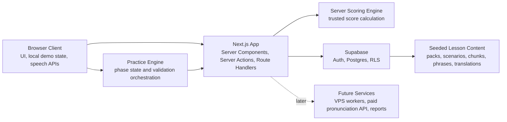
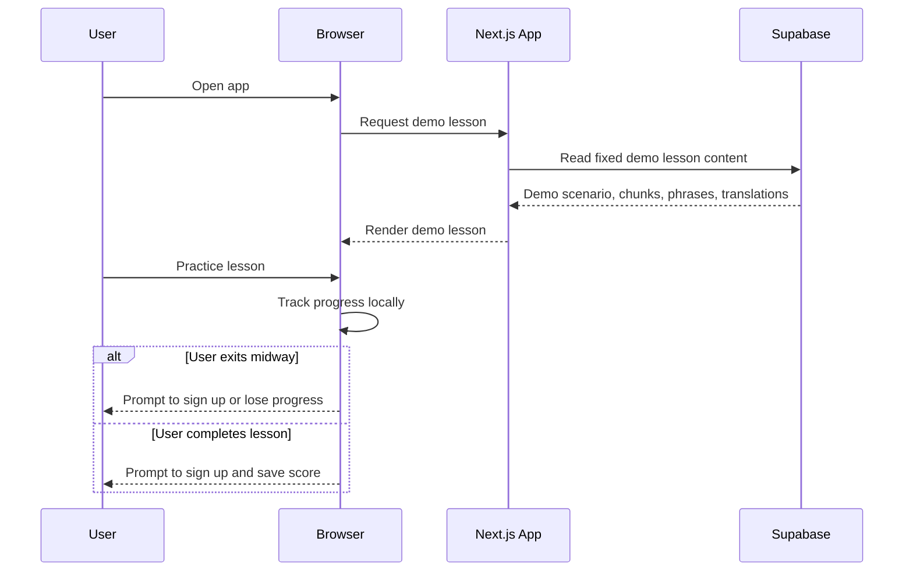
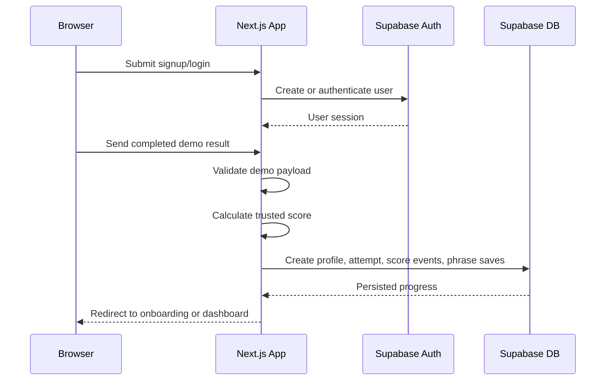
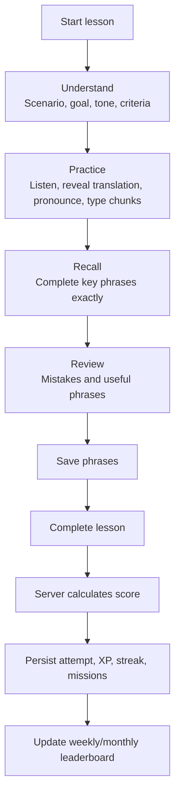

# FluentDraft System Design

## Purpose

This document describes how FluentDraft should work end to end for the MVP.

It is more detailed than [architecture.md](./architecture.md) and should guide later database design, API contracts, project structure, and testing decisions.

## Goals

- Let anonymous users try one fixed demo lesson before registering.
- Convert demo users into registered users by offering to save progress, score, and leaderboard eligibility.
- Support onboarding with English level, target translation language, and country.
- Deliver the core learning loop: Understand, Practice, Recall, Save.
- Support exact text checking for typed phrase answers.
- Support browser-first pronunciation practice with graceful fallback.
- Store lesson content in Supabase/Postgres as seeded data.
- Calculate trusted score and leaderboard-impacting results on the server.
- Support professional gamification: XP, streaks, badges, levels, ranks, missions, unlocks, weekly leaderboard, and monthly leaderboard.
- Keep the MVP as a web app while leaving room for future mobile apps.

## Non-Goals For MVP

- Native mobile apps.
- Stripe payments.
- Redis-backed leaderboard infrastructure.
- Paid pronunciation API integration.
- Advanced AI writing feedback.
- User-generated custom scenarios.
- Fully localized app UI.
- VPS-hosted primary backend.

## Access Modes

### Anonymous Demo User

Anonymous users can:

- Open the app.
- Start one fixed demo lesson.
- Practice the demo in browser state.
- See a signup prompt when exiting midway.
- See a signup prompt after completing the demo.

Anonymous users cannot:

- Access the full lesson catalog.
- Persist progress to Supabase.
- Save phrases permanently.
- Appear on leaderboards.
- Earn durable XP, badges, streaks, missions, or ranks.

### Registered User

Registered users can:

- Complete onboarding.
- Access MVP scenario packs.
- Practice lessons.
- Save phrases.
- Review Phrase Bank items.
- Persist attempts, scores, streaks, and progress.
- Appear on weekly and monthly leaderboards with display name and country.

## Major System Components

## Core Flows

### Anonymous Demo Flow

Demo state should be browser-only for MVP. It can use in-memory state and local/session storage where useful. No anonymous server session is required for MVP.

### Signup And Demo Conversion

The browser may provide demo activity details, but the server must validate and calculate trusted score before persistence.

### Registered Practice Flow

## State Management

### Browser State

Browser state should handle:

- Current practice phase.
- Current chunk.
- Typed answer draft.
- Pronunciation recording status.
- Browser speech recognition result.
- Translation reveal state.
- Demo lesson progress before signup.
- Temporary UI feedback.

### Server State

Server state should handle:

- Trusted score calculation.
- Demo conversion validation.
- Registered lesson attempt persistence.
- Phrase save persistence.
- Streak and mission updates.
- Badge awards.
- Leaderboard updates.

### Database State

Database state should handle:

- User profiles.
- Onboarding choices.
- Seeded lesson content.
- Attempts and phrase attempts.
- Pronunciation attempt summaries.
- Phrase Bank items.
- Reviews and mastery.
- Score events.
- Streaks.
- Badges, missions, levels.
- Weekly and monthly leaderboard entries.

## Data Consistency Rules

- First full completion of a lesson gives full eligible points.
- Repeating the same lesson gives reduced points.
- Skipped required phases reduce total score.
- Exact text answer checking is required for typed phrase answers.
- Leaderboard-impacting scores must be calculated or verified on the server.
- Weekly and monthly leaderboard periods must be explicit and reset by period.
- Country and display name can appear on public leaderboard views.
- Private learning data must stay user-owned and protected by RLS.
- Saved phrases must link back to their source scenario and phrase where possible.

## Pronunciation Design

MVP pronunciation uses browser speech recognition where available.

The practice screen should:

- Show the expected key phrase.
- Ask the user to read/pronounce it.
- Capture the browser transcript.
- Compare transcript to the expected phrase.
- Return simple feedback: pass, retry, or unsupported.

If microphone permission is denied or browser speech recognition is unavailable, the user should still be able to continue the lesson. The app should explain the limitation without blocking the full learning flow.

Later, a paid pronunciation API can provide better scoring, phoneme-level feedback, and accent-aware guidance. The MVP should isolate pronunciation logic so this upgrade does not rewrite the entire practice engine.

## Translation Design

English remains the main learning language.

Translations are optional helpers inside the practice screen. Users choose a target language during onboarding. MVP should support Arabic plus common languages so the product is not tied only to Arabic-speaking learners.

Translation reveal should be user-triggered and should not dominate the practice screen. The goal is to support understanding while keeping the user focused on English recall and production.

## Gamification Design

Gamification should motivate repeat practice while keeping the app professional.

MVP gamification includes:

- XP.
- Streaks.
- Badges.
- Levels.
- Ranks.
- Missions.
- Unlocks.
- Weekly leaderboard.
- Monthly leaderboard.
- Country-based competition signals.

Leaderboards should display safe public fields only: display name, country, rank, score, and period. Weekly and monthly resets give new users a fair chance to compete.

## Security And Privacy

- Use Supabase Auth for registered users.
- Use RLS for all user-owned tables.
- Public leaderboard data must be limited to safe fields.
- Microphone audio should be processed through browser APIs for MVP and not stored as raw audio unless a later feature explicitly requires it.
- Browser speech transcripts can be stored as pronunciation attempt summaries for registered users, but should be treated as learning data.
- Demo state is local until signup.
- Admin-only tables should protect lesson content, supported languages, badge definitions, mission definitions, and level thresholds.

## Failure Modes

| Failure | Expected Behavior |
| --- | --- |
| Browser speech unsupported | Show unsupported message and allow lesson continuation |
| Microphone denied | Explain permission issue and allow skip/continue |
| Network failure during registered lesson | Keep local progress where possible and retry persistence |
| Signup after demo fails | Keep demo result in browser state and let user retry |
| Score persistence fails | Show retryable error and avoid pretending the score was saved |
| Leaderboard update delayed | Save score first; leaderboard can refresh after persistence succeeds |
| Translation unavailable | Keep English practice usable and show a non-blocking message |

## Scaling Path

MVP should stay Supabase-first:

- Supabase Auth for accounts.
- Supabase Postgres for content, attempts, phrase bank, scores, and leaderboards.
- Postgres-first leaderboard queries and aggregates.

Later upgrades:

- Contabo VPS for background workers, reports, audio processing, or API orchestration.
- Paid pronunciation API for richer feedback.
- Redis or cached leaderboard aggregates if Postgres leaderboard queries become heavy.
- Stripe for premium plans.
- Mobile app clients using the same core backend contracts.

## Open Decisions

- Exact list of common target languages for MVP.
- Whether phrase mastery should use a simple status or spaced-repetition scheduling from day one.
- Whether browser demo state should use only session storage or also local storage.
- Whether weekly/monthly leaderboard aggregation is updated on lesson completion or via scheduled jobs.

## Related Docs

- [Docs index](./README.md)
- [plan.md](../plan.md)
- [architecture.md](./architecture.md)
- [database.md](./database.md)
- [api-contracts.md](./api-contracts.md)
- [project-structure.md](./project-structure.md)
- [style-guide.md](./style-guide.md)
- [testing-strategy.md](./testing-strategy.md)
