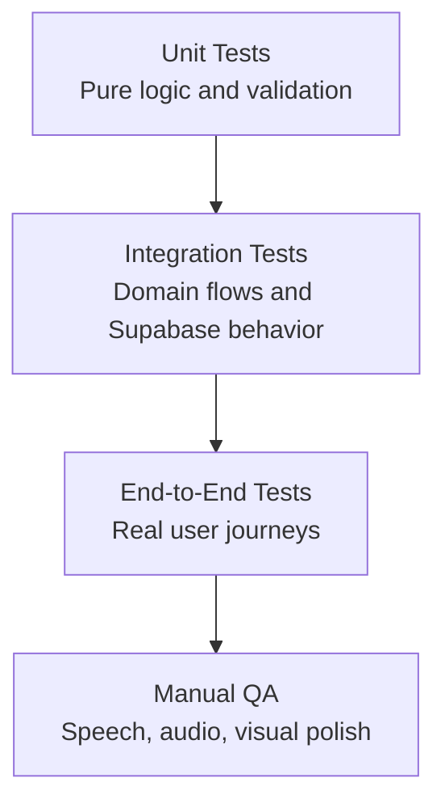

# FluentDraft Testing Strategy

## Purpose

This document defines how FluentDraft should be tested as the product is built.

The goal is to protect the core learning experience: demo conversion, practice flow, exact answer checking, pronunciation feedback, phrase saving, scoring, gamification, and leaderboards.

## Testing Principles

- Test the learning loop first: Understand, Practice, Recall, Save.
- Keep scoring and leaderboard logic heavily covered because users will care about fairness.
- Treat demo conversion as a critical business flow.
- Test browser speech features with graceful fallback, because support varies by browser.
- Prefer deterministic tests for scoring, validation, and data rules.
- Use end-to-end tests for full user journeys, not every small UI state.
- Make mobile layout checks part of acceptance, not an afterthought.

## Test Layers

## Unit Tests

Unit tests should cover pure logic that can be checked quickly and repeatedly.

Priority areas:

- Exact text answer validation.
- Attempt counting per phrase.
- First-try and retry scoring.
- Difficulty multipliers.
- Perfect recall bonus.
- Completion points.
- Save phrase bonus.
- Daily streak bonus.
- Reduced points for repeated lesson completion.
- Phrase mastery status changes.
- Mission progress calculation.
- Level progression from XP.
- Weekly and monthly leaderboard period calculations.
- Translation reveal state rules.
- Unsupported pronunciation fallback logic.

## Integration Tests

Integration tests should verify that product domains work together correctly.

Priority flows:

- Anonymous user starts the fixed demo lesson.
- Anonymous user exits midway and sees the lost-progress signup prompt.
- Anonymous user completes demo and is prompted to save progress.
- User signs up after demo and demo progress attaches to their account.
- User completes onboarding with English level, target language, and country.
- Registered user starts a scenario from dashboard or pack page.
- User reveals translation inside practice.
- User completes guided chunk typing with exact answer checks.
- User completes recall mode.
- User saves phrases to Phrase Bank.
- User reviews a phrase and mastery status updates.
- User earns score, XP, streak, and mission progress.
- Weekly and monthly leaderboard entries update with display name and country.

## End-To-End Tests

E2E tests should cover the highest-value user journeys in the browser.

Recommended MVP E2E scenarios:

1. Anonymous demo completion
   - Open the app.
   - Start the fixed demo lesson.
   - Complete the lesson.
   - See the save-progress signup prompt.

2. Anonymous demo exit
   - Start the fixed demo lesson.
   - Exit midway.
   - See the warning that score/progress will be lost unless the user signs up.

3. Signup and onboarding
   - Create account.
   - Choose English level.
   - Choose target language.
   - Choose country.
   - Arrive at dashboard.

4. Registered lesson completion
   - Start a lesson.
   - Move through Understand, Practice, Recall, and Save.
   - Save at least one phrase.
   - See score and completion summary.

5. Phrase Bank review
   - Open Phrase Bank.
   - Start a review.
   - Complete the missing phrase.
   - Mark Easy or Hard.
   - Confirm mastery or review state updates.

6. Leaderboard visibility
   - Complete a scored activity.
   - Open weekly leaderboard.
   - Confirm display name, country, rank, and score are visible.

## Manual QA

Some areas need manual verification because browser APIs, audio, and visual layout can vary.

Manual checks:

- Text-to-speech voice quality is acceptable and close enough to native-like for MVP.
- Speech recognition works where supported.
- Pronunciation feedback gives a clear pass/retry result.
- Unsupported browsers degrade gracefully.
- Microphone permission denial is handled clearly.
- Translation reveal does not distract from the English-first practice flow.
- Practice screen remains focused and not visually childish.
- Gamification feels motivating but still professional.
- Mobile screens have no overlapping text or cramped controls.
- Long names, long countries, and long translated phrases do not break layout.

## Supabase And RLS Testing

Supabase behavior should be tested before production use.

Required checks:

- Users can read and update only their own profile.
- Users can read and write only their own lesson attempts.
- Users can read and write only their own phrase bank items.
- Users can read and write only their own phrase reviews.
- Users can read their own streaks, badges, missions, and scores.
- Public leaderboard views expose only safe public fields.
- Lesson content is readable according to free/demo/MVP access rules.
- Admin-only content tables cannot be modified by normal users.

## Accessibility And Usability Checks

Minimum checks:

- All primary actions are keyboard reachable.
- Buttons and inputs have accessible names.
- Practice steps have clear focus states.
- Error and success feedback is visible and understandable.
- Color is not the only way mistakes or success are communicated.
- Audio/pronunciation actions have text labels or tooltips.
- Forms show useful validation messages.

## Performance Checks

MVP performance targets:

- Dashboard loads quickly with user progress summary.
- Practice screen does not block on non-critical leaderboard or dashboard data.
- Lesson transitions feel immediate.
- Speech and audio controls do not freeze the UI.
- Leaderboard queries remain fast for weekly and monthly views.

## Test Data

Seed data should include:

- One fixed demo lesson.
- At least one scenario from each MVP pack.
- Beginner, Intermediate, and Advanced lessons.
- Key phrases with translations.
- A few fake leaderboard users with different countries.
- Badges, missions, and level thresholds.
- Phrase bank examples in New, Learning, and Mastered states.

## Release Acceptance Checklist

- Demo lesson works without registration.
- Demo completion prompts signup to save progress.
- Demo exit warns about lost progress.
- Signup and onboarding work.
- Registered user can complete a lesson.
- Exact text checking works.
- Translation reveal works for supported target languages.
- Pronunciation flow works or degrades gracefully.
- Score, XP, streak, and saved phrases persist.
- Phrase Bank review works.
- Weekly and monthly leaderboards display name and country.
- Mobile and desktop practice screens are visually stable.
- Supabase RLS checks pass.

## Related Docs

- [Docs index](./README.md)
- [plan.md](../plan.md)
- [system-design.md](./system-design.md)
- [architecture.md](./architecture.md)
- [database.md](./database.md)
- [api-contracts.md](./api-contracts.md)
- [project-structure.md](./project-structure.md)
- [style-guide.md](./style-guide.md)
